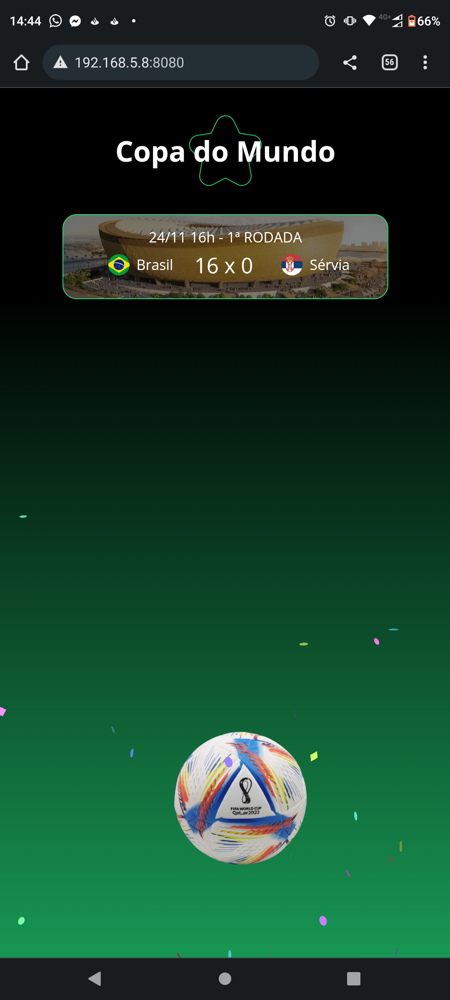
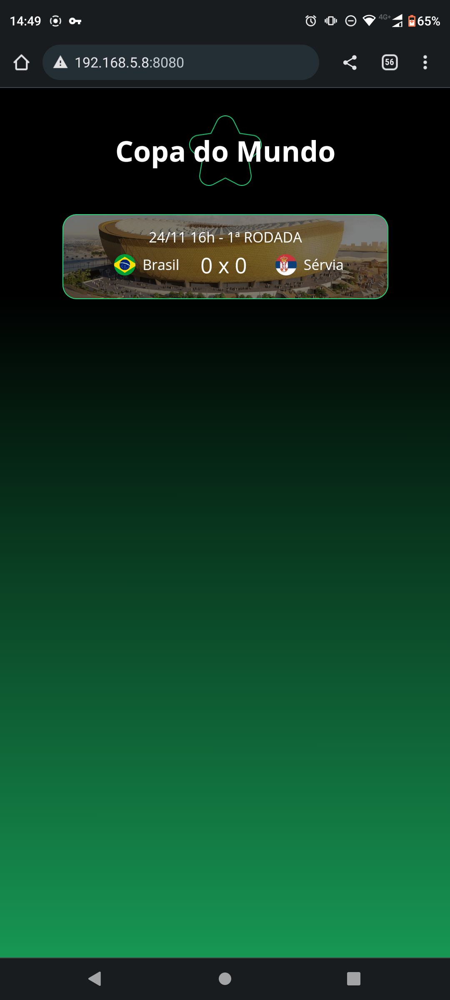

# Copa-Do-Mundo-HTML-CSS-JS-Firebase
 Um site feito em HTML-CSS-JAVASCRIPT 
 Que apresenta um jogo do brasil contra  sérvia e quando obrasil faz gol
 exibe animação de confete uma imagem da bola da copa e um áudio do galvão Bueno
 A atualização do saldo dos gols é implementada inicialmente atravéz do firebase.
 Mas devido as credenciais estarem sendo expostas no github o firebase foi substituido por um metodo que 
 é chamado a cada 10 segundos para gol do Brasil e a cada 8 segundos para gol da sérvia
 # Tela do App
 
 

 # Animação de Gol
 

#Video Apresentação

<video width="320" height="240" controls>
  <source src="apresentation/apress.mp4" type="video/mp4"> 
Your browser does not support the video tag.
</video>